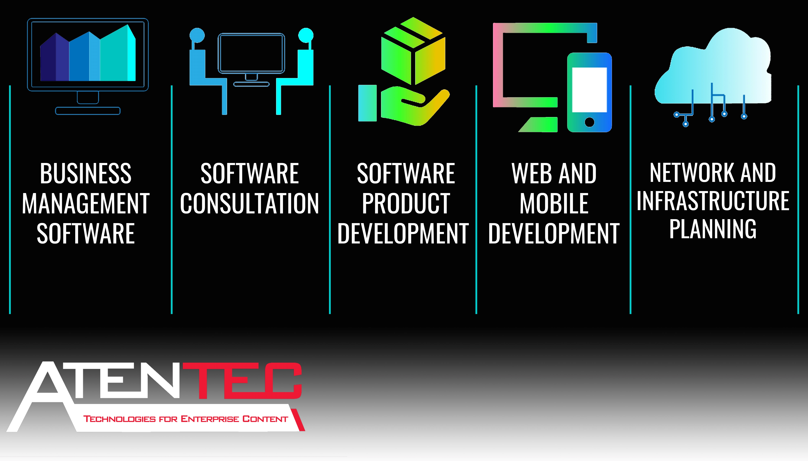

# AtenTEC

AtenTEC is a software, research and development company headquartered in South Sinai, Egypt. AtenTEC is specialized in developing custom software systems for business and operation management. AtenTEC has an extensive experience in analysis and consultation of business needs and addressing business challenges through real software solutions.

AtenTEC name is derived from Aten; the sun disc in ancient Egyptian religion, which is an aspect of Ra, the sun god. Just as Aten gives power to earth in ancient Egyptian mythology, our solutions also shine on business sector and gives our customers the power to grow and maximize their business, hence created our philosophy. TEC stands for Technologies for Enterprise Content, the domain which we focus

# Get Involved
As a member of AtenTEC family, we encourge you to explore our featured repositories to enhance your skills, collaborate, and share experience:
1. [Train Your Brain: A collection of exercises and quizes](https://github.com/atentec/train-your-brain)
2. [AtenTEC - Technical Articles: Selected technical articles written by our teams for challenging subjects](https://github.com/atentec/atentec-tech-articles)
3. [Developers Onboarding: 6 days projects for new commers to refresh and enhance their skills](https://github.com/atentec/atentec-dev-onboarding)
4. [Developers Notes: Categorized notes for various technologies for your daily tasks](https://github.com/atentec/devnotes)
